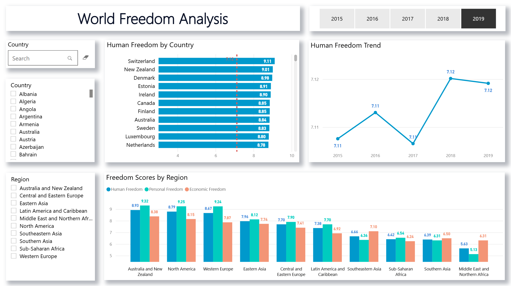
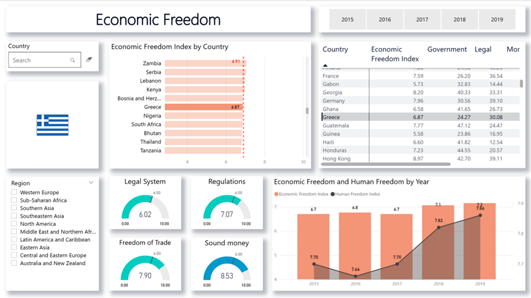
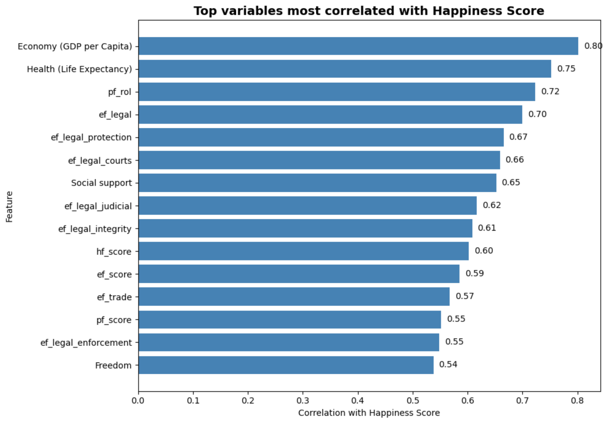
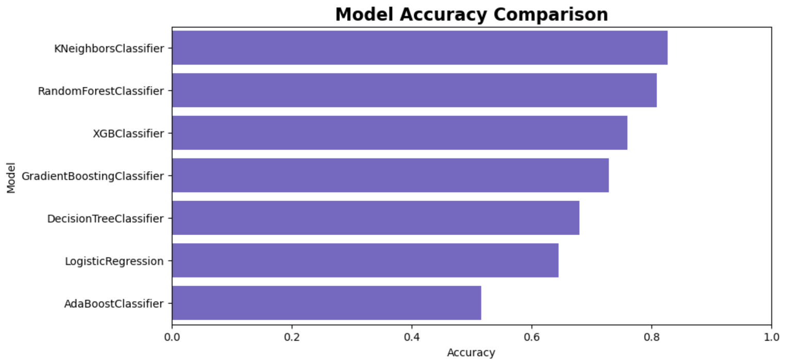
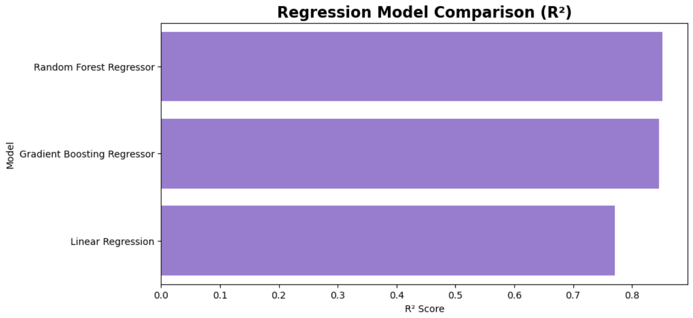

# Human Freedom and Happiness Analysis

End-to-end analytics project combining data cleaning, dataset integration, exploratory analysis, missing value handling, basic machine learning, and Power BI-ready data preparation.

## Project background

I originally developed this work during a post-secondary diploma program in Big Data Analysis and Data Engineering in Italy, and later cleaned it up into a portfolio version while keeping the original logic of the analysis.

The project focuses on understanding how a country’s happiness score relates to a broader set of economic, social, institutional, and freedom-related indicators across the years 2015 to 2019.

## Project goals

The main goals of this project are:

- understand which factors are more strongly associated with a country’s happiness score
- compare happiness and freedom-related indicators across multiple years
- clean and align datasets coming from different sources and structures
- handle missing values with a more informed approach than simple global filling
- build simple predictive models for both a categorical and a continuous target
- prepare a clean final dataset that can be exported and used in Power BI

## Data sources

This project combines two main sources:

- **World Happiness Report** datasets from 2015 to 2019
- **Human Freedom Index** data for the same years

The raw files were cleaned, standardized, aligned, and merged into a final analytical dataset used for both modeling and BI output.

## Workflow

The project follows this workflow:

1. Load the source data
2. Check the raw structure and data quality
3. Clean country names, columns, and formats
4. Align and merge happiness and freedom datasets
5. Handle missing values
6. Export a clean final table for Power BI
7. Explore correlations and trends
8. Build simple models for a categorical target
9. Build simple models for a continuous target

## Main steps

### 1. Data ingestion and structure checks

The notebook starts by loading the raw source files and checking their structure. Since the files come from different years and sources, the first step is to verify column names, formats, and consistency before any merge.

### 2. Data cleaning and alignment

A large part of the project is dedicated to cleaning and standardizing the raw data. This includes:

- fixing inconsistent country names
- aligning columns across files and years
- removing extra fields that are not useful for the final analysis
- standardizing formats and data types

This step is necessary because the source files are not fully aligned and contain several inconsistencies.

### 3. Missing value handling

Missing values are handled with two different approaches depending on the case:

- simple fill strategies when the number of missing values is very small
- regression-based estimation when a target column has enough correlation with other useful variables

The goal is to preserve more structure from the data instead of relying only on a basic global fill.

### 4. Final dataset preparation for Power BI

After cleaning and missing value handling, the notebook creates a final table that is exported to CSV and later used in Power BI for dashboarding and visual analysis.

### 5. Exploratory analysis

The EDA section focuses on:

- scatter plots between selected variables and Happiness Score
- correlation checks
- outlier inspection
- ranking of the strongest variables associated with the target

This part highlights that happiness is strongly associated not only with economic variables, but also with institutional and freedom-related indicators.

### 6. Classification modeling

For the categorical target, I compare several classification models:

- Logistic Regression
- KNN
- Decision Tree
- Random Forest
- Gradient Boosting
- AdaBoost
- XGBoost

I then run a small hyperparameter search on the strongest models to compare baseline and tuned performance.

**Main classification result:**  
KNN gives the best baseline result, with an accuracy of about **0.83**.

### 7. Regression modeling

For the continuous target, I compare:

- Linear Regression
- Random Forest Regressor
- Gradient Boosting Regressor

**Main regression result:**  
Random Forest gives the best overall result, with an **R² score of about 0.85**, while Gradient Boosting is very close behind.

## Key results

Some of the main takeaways from the project are:

- GDP per capita and life expectancy are among the strongest variables associated with Happiness Score
- legal quality, justice, and broader freedom indicators also show strong relationships with happiness
- KNN is the strongest classifier in the baseline comparison
- tuning confirms the stronger models, but does not completely change the overall ranking
- for the continuous target, tree-based regressors perform better than Linear Regression
- the workflow also produces a final clean dataset that can be used directly in Power BI

## Visual highlights

### Main dashboard views

These screenshots show the Power BI layer built on top of the cleaned final dataset prepared in Python. After exporting the final tables, I used Power Query for additional transformations and built the data model with dimensions and relationships for the final dashboard.

#### World Freedom Analysis


#### Economic Freedom


### Notebook visuals

The notebook also includes a few key analytical views used to summarize the strongest patterns in the data and compare model results.

#### Correlation summary


#### Classification model comparison


#### Regression model comparison


### Additional dashboard views

Additional Power BI pages are available in the `visuals/` folder:

- `powerbi_country_view.png`
- `powerbi_personal_freedom.png`

## Repository structure

```text
human-freedom-happiness-analysis/
├── README.md
├── requirements.txt
├── .gitignore
├── notebooks/
│   └── human_freedom_happiness_analysis.ipynb
├── data/
│   ├── raw/
│   │   ├── 2015.csv
│   │   ├── 2016.csv
│   │   ├── 2017.csv
│   │   ├── 2018.csv
│   │   ├── 2019.csv
│   │   └── hfi_cc_2021.csv
│   └── processed/
│       ├── human_freedom_index_with_estimated_null_values.csv
│       └── world_happiness_reports_with_estimated_null_values.csv
└── visuals/
    ├── powerbi_dashboard.png
    ├── powerbi_economic_freedom.png
    ├── powerbi_country_view.png
    ├── powerbi_personal_freedom.png
    ├── correlation_summary.png
    ├── classification_model_comparison.png
    └── regression_model_comparison.png
```

## Tools used

- Python
- Pandas
- NumPy
- Matplotlib
- Seaborn
- Plotly
- scikit-learn
- XGBoost
- Power BI
- Power Query

## How to run

1. Clone the repository
2. Install the required libraries
3. Open the notebook inside the `notebooks/` folder
4. Make sure the raw and processed files are in the expected `data/` folders
5. Run the notebook step by step

## Notes

This is a portfolio version of a project originally developed during a post-secondary diploma program in Big Data Analysis and Data Engineering in Italy. The goal of this repository is not to present a production-grade ML pipeline, but to show a full analytics workflow: data cleaning, integration, exploratory analysis, simple modeling, and final BI-oriented output.

## Author

**Emanuele Roccella**